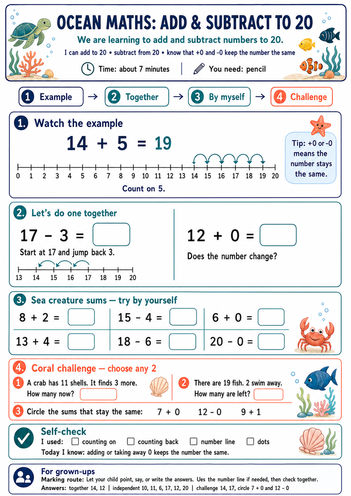
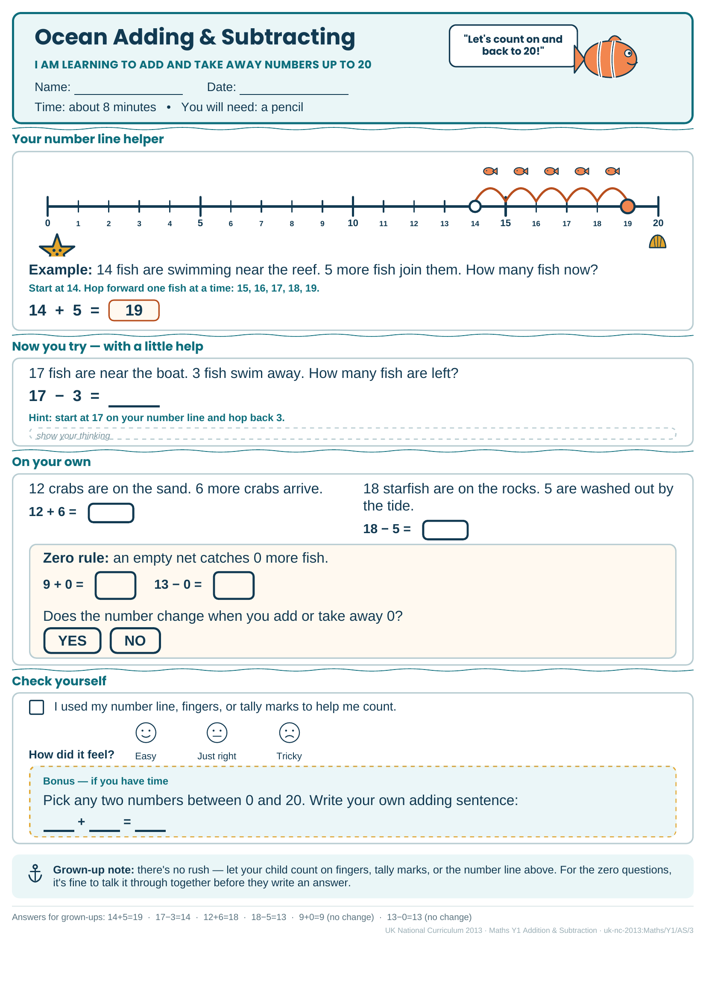
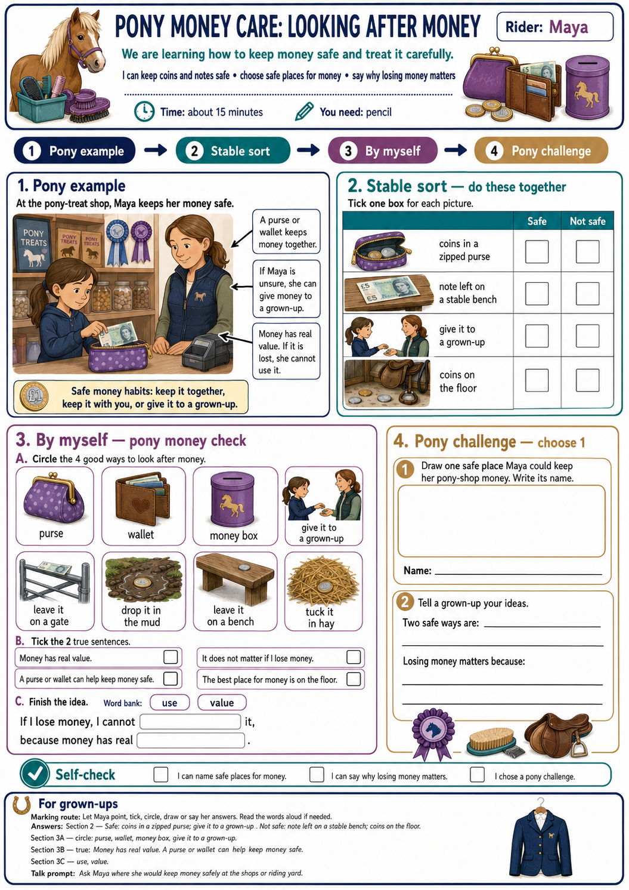
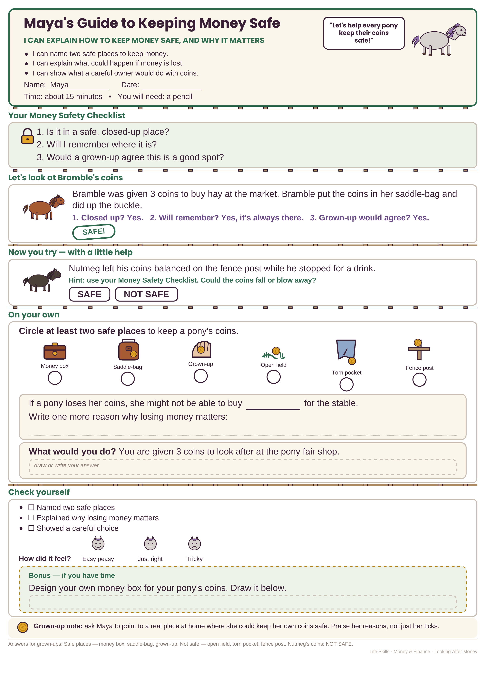

# Agentic Tutor

A hobby project designed to run on a **home server**: local-first worksheet generation and progress tracking for primary-age children. Not a hosted SaaS — install it, keep the data on your machine, and run it yourself.

## What this app is attempting to do

1. **Track the journey** — Let parents follow their children’s educational progress against every learning point in an open skill taxonomy (subjects, domains, micro-topics, and prerequisites).
2. **Tailored worksheets** — Generate printable worksheets that cover the right topics in the correct order of learning, in a fun and engaging way.

## Worksheet design research

Worksheet generation should eventually follow scientific best practice, not vibes. This repo includes a deep-research brief — [`docs/deep-research-report.md`](docs/deep-research-report.md) — that the LLMs will use as the design brief when producing worksheets.

Condensed from that report:

A well-designed homework worksheet is age-calibrated: it reduces unnecessary cognitive load, makes the goal obvious, gives children an early sense of competence, and stays simple for adults to assign and review. Children learn better when non-essential material is removed, key information is signposted, words and pictures sit close together, feedback is timely and task-focused, and the format matches developmental stage rather than adult aesthetic preferences.

**Evidence-backed principles the agent should follow:**

- **Reduce extraneous load before adding “fun”** — Cut irrelevant text and decoration; signal structure; keep words and diagrams together; segment multi-step tasks. Fun should come from relevance and agency, not clutter.
- **Scaffold heavily, then fade** — Prefer model → guided attempt → independent attempt → brief self-check. Younger learners need worked examples first; older primary can shift toward planning prompts and checklists.
- **Feedback that builds competence** — Prefer specific, improvement-oriented guidance over grades or evaluative labels about the child.
- **Intrinsic motivation first** — Support autonomy (tiny choice), competence (visible progress, early success), and relatedness (familiar contexts). Keep rewards light, informational, and non-controlling.
- **Scannable hierarchy** — Clear reading order in one glance: strong headings, high contrast, legible sans serif, calm spacing. Colour is a secondary cue, never the only one.
- **Inclusion by default** — Anticipate variability: pictures plus words, explicit must-do items, adaptable language and examples, free of stereotypes.

Suggested core durations from the research: about **5–8 minutes** (ages 4–6), **10–15 minutes** (7–9), **15–20 minutes** (10–12), with optional stretch rather than mandatory extras.

See the [full report](docs/deep-research-report.md) for age-band templates, print specs, evaluation metrics, and A/B ideas.

## Example worksheets

These reference worksheets were generated with [`docs/examplePrompt.md`](docs/examplePrompt.md) against topics from the taxonomy dataset, constrained by the deep-research checklist.

### Adding and subtracting (ocean theme)

*Mathematics · ages 5–6*

#### OpenAI (Sol)



#### Claude Sonnet 5



### Looking After Money (pony theme)

*Life Skills · Money & Finance · ages 5–7 · child: Maya*

#### OpenAI (Sol)



#### Claude Sonnet 5



## Guided tutor (per-child fine-tuning)

The app includes a parent-friendly **guided tutor** loop:

1. **Get to know them** — a short baseline questionnaire seeds a starting picture of the child’s strengths and tricky spots.
2. **Today’s lesson** — the tutor proposes a focus topic, theme, and age-appropriate time.
3. **Practice** — a printable worksheet is generated; behind the scenes one research-backed design style is under test (calm pages, clear goals, choice, etc. — see [`docs/deep-research-report.md`](docs/deep-research-report.md)).
4. **How it went** — after you upload a scan, a few taps (finished? time? help? faces?) teach the tutor what helps *this* child.
5. **Insights** — plain-English notes on styles that seem to help, with an optional parent override.

Parents never need to think about AI or experiments — the primary button is simply **Continue with the tutor**. Advanced “create worksheet yourself” remains available.

## Roadmap

- **Agent quality** — Worksheet generation now uses [`docs/examplePrompt.md`](docs/examplePrompt.md) plus the deep-research design brief via OpenAI image generation.
- **Per-child fine-tuning** — ✅ Guided tutor with research-based A/B design experiments and per-child preferences.
- **Supplemental lead** — Have the agent lead the child’s supplemental education over time.
- **Home printing** — Automatically integrate with a local printer to print children’s worksheets each day.

## Quick start

```bash
npm install
cp app/.env.example app/.env
npm run seed          # optional; auto-seeds on first API boot
npm run dev
```

- UI: http://127.0.0.1:5173
- API: http://127.0.0.1:8787

Demo mode is **on** by default (`DEMO_MODE=true`) — no API keys required. See [`app/README.md`](app/README.md) for live-agent setup and scripts.

```bash
npm test              # unit + API tests
npm run test:e2e      # Playwright
node scripts/validate.mjs   # taxonomy structure + referential integrity
```

## Bundled taxonomy

Learning points come from the **Marble Skill Taxonomy (v1)** — an open, graph-structured dataset of primary/elementary micro-topics, prerequisites, and curriculum alignments. Explore it interactively at [withmarble.com/curriculum](https://withmarble.com/curriculum); the original open-source release is [`withmarbleapp/os-taxonomy`](https://github.com/withmarbleapp/os-taxonomy).

| Path | What it holds |
|---|---|
| [`data/`](data/) | Topics, dependencies, clusters, curriculum standards, manifest |
| [`schema/`](schema/) | JSON Schemas for the data files |
| [`scripts/validate.mjs`](scripts/validate.mjs) | Structure + referential integrity checks |

## Thanks

Huge thanks to [Marble](https://withmarble.com) and the team behind [`withmarbleapp/os-taxonomy`](https://github.com/withmarbleapp/os-taxonomy) for releasing this taxonomy as open source. This hobby project would not exist without that gift to the community.

## License

The bundled taxonomy is **multi-licensed** — read this before you use or redistribute it.

| Layer | License |
|---|---|
| **The database** — the collection, structure, IDs, topic↔topic and topic↔standard relationships | [**ODbL 1.0**](LICENSE) — free for research **and** commercial use, **attribution** required, **share-alike** (derivative *databases* must stay open under ODbL). |
| **The textual content Marble authored** — topic `description`/`name`/`evidence`/`assessmentPrompt`, dependency `reason`s, cluster `summary`s | [**CC BY-SA 4.0**](LICENSE-CONTENT) — same spirit: attribution + share-alike. |
| **`curriculum-standards.json`** — extracted from third-party frameworks | **Not** Marble's to relicense. Each source is under **its own upstream license** — see [**PROVENANCE.md**](PROVENANCE.md). |

**Why share-alike + still commercial-friendly:** ODbL distinguishes a *derivative database* (extend/modify the taxonomy → must stay open) from a *produced work* (use it inside a product, model, or app → stays yours). So you can build a commercial product on this without open-sourcing your product; you only owe back improvements to the *taxonomy itself*.

### Attribution

Any use of the taxonomy must credit:

> Marble Skill Taxonomy (v1) · © Generative Spark, Inc. (Marble) · https://withmarble.com · licensed under ODbL 1.0 (database) and CC BY-SA 4.0 (content).

Plus the upstream notices in [PROVENANCE.md](PROVENANCE.md) for any curriculum standards you use. See [CITATION.cff](CITATION.cff) for a formal citation. Source: [github.com/withmarbleapp/os-taxonomy](https://github.com/withmarbleapp/os-taxonomy).
