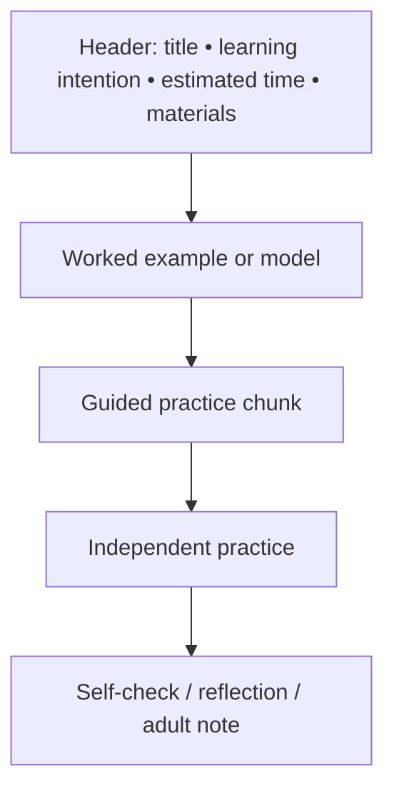
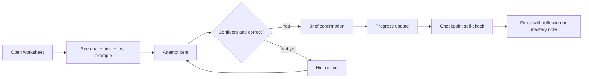
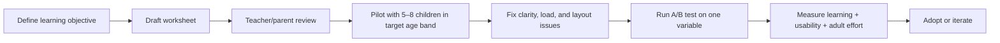

# Designing Homework Worksheets That Children Want to Do

## Executive summary

A “perfectly designed” homework worksheet is not a single universal artefact. It is an age-calibrated learning tool that reduces unnecessary cognitive load, makes the task goal obvious, gives children an early sense of competence, and is simple for adults to assign, support, and review. The evidence base is strikingly consistent on a few points: children learn better when non-essential material is removed, key information is signposted, words and pictures are placed close together, feedback is timely and task-focused, and the format matches children’s developmental stage rather than adult aesthetic preferences. citeturn16view2turn18search3turn16view0turn12view5turn17view3turn13view9

For ages 4–6, the best worksheet is short, concrete, highly scaffolded, visually chunked, and largely print-first because handwriting and physical manipulation support early symbol learning, while young children’s sustained attention, fine motor control, and working memory are still developing rapidly. For ages 7–9, worksheets can introduce simple independence, self-checks, and light choice, but still need strong structure. For ages 10–12, the design can become denser and more open-ended, yet should still preserve clear hierarchy, modest chunking, and explicit success criteria because executive function and working memory continue to develop through middle childhood. citeturn17view3turn22view0turn17view1turn13view9turn13view6

The best motivational mix is mostly intrinsic and competence-supportive: relevant contexts, meaningful choice, visible progress, and brief mastery feedback. Extrinsic rewards can help as light signals of progress, but controlling or completion-contingent rewards are risky when overused because they can undermine intrinsic motivation. In practice, this means using badges, stickers, or points sparingly and framing them as information, celebration, or optional extension rather than payment for compliance. citeturn12view3turn15search4turn15search10turn11search14

Visually, the strongest worksheets follow mainstream usability and accessibility principles rather than “children’s media” clichés. They use strong visual hierarchy, high text contrast, uncluttered backgrounds, legible sans serif fonts, short instructions in active voice, and colour as a secondary cue rather than the only cue. Relevant illustrations help when they clarify the task; decorative clutter, “seductive details”, and wallpaper-like backgrounds reliably hurt comprehension. citeturn12view5turn12view2turn19view1turn12view9turn18search0turn18search3

Because the prompt did not specify curriculum, subject, language, SEND profile, printing budget, or device access, the report treats the worksheet as a general-purpose homework format for low- to medium-stakes practice. Wherever a recommendation depends on those missing constraints, it is flagged explicitly rather than assumed.

## Developmental realities that should drive the design

A worksheet only feels “fun” when it is pitched inside a child’s developmental bandwidth. Between roughly 2 and 7 years, children are in Piaget’s preoperational stage: they can work with symbols, but language, perspective-taking, inference, and self-monitoring are still immature. From about 7 to 11, children become more logical and concrete in their reasoning, but executive function, cognitive flexibility, and planning remain under construction. In parallel, executive-function components such as inhibition, working memory, and shifting strengthen substantially across childhood and adolescence rather than reaching adult levels in the early primary years. citeturn20view0turn13view9turn17view1

This has direct design consequences. In children aged 5–12, sustained attention improves rapidly from roughly 5–6 to 8–9 years and then begins to plateau, while performance worsens under higher task load. Working-memory capacity also expands substantially across the school years. Put simply: younger children need fewer simultaneous demands, more visible structure, and shorter bursts; older children can handle more independent problem-solving, but not unlimited density or ambiguity. citeturn17view3turn17view1turn17view2

Motor development matters as much as cognition. NN/g’s child UX research found that for children under about 9, touch targets should be much larger than adult defaults, simple gestures are easier than precise dragging, and complex fine-motor tasks can turn an otherwise engaging activity into a frustrating one. That maps cleanly to worksheet design: early worksheets should avoid tiny answer boxes, cramped lines, intricate cut-and-stick mechanics, or “trace this microscopic path” tasks that test dexterity more than learning. citeturn22view0turn13view0

These developmental data also suggest conservative homework duration targets. A sensible starting point is **about 5–8 minutes of core work for ages 4–6, 10–15 minutes for ages 7–9, and 15–20 minutes for ages 10–12**, with optional extension rather than mandatory extra items. That timing is an inference from the literature on age-related gains in sustained attention, working memory, and executive control, not a hard universal rule, so it should be adjusted for subject difficulty, reading load, and individual need. citeturn17view3turn17view1turn13view9

```mermaid
gantt
    title Suggested completion windows
    dateFormat  X
    axisFormat %s min
    section Ages 4–6
    Core task              :a1, 0, 6
    Optional stretch       :a2, 6, 2
    section Ages 7–9
    Core task              :b1, 0, 12
    Optional stretch       :b2, 12, 3
    section Ages 10–12
    Core task              :c1, 0, 18
    Optional stretch       :c2, 18, 4
```



## Evidence-backed design principles

### Reduce extraneous load before adding “fun”

Cognitive Load Theory and multimedia-learning research point in the same direction: the worksheet should minimise extraneous processing so the child’s limited working memory can be spent on the target concept. In practice, this means removing irrelevant text and pictures, adding signals that highlight essential structure, keeping words and diagrams physically close, segmenting multi-step tasks, and pretraining any unfamiliar symbols before asking children to apply them. Decorative sidebars, mascots that do not teach anything, and crowded multi-panel compositions are not harmless extras; they often steal processing from the core task. citeturn0search4turn16view2turn18search3turn18search0

The “fun” layer should therefore come from relevance and agency, not clutter. Interest-development research shows that situational interest is triggered and then maintained when learners see personal meaning and value in the activity. CAST’s UDL 3.0 now explicitly frames design around choice and autonomy, relevance and authenticity, and joy and play. A good worksheet uses those levers: familiar scenarios, child-recognisable characters or contexts, one or two real choices, and a short sense of progress. citeturn5search7turn5search19turn12view3

### Scaffold heavily at the start and fade support with age

The best worksheets do not ask children to leap straight from instruction to independent performance. They use a progression of **model → guided attempt → independent attempt → brief reflection/self-check**. This reflects both classic scaffolding logic and constructive-alignment literature: learning activities and assessment should line up with the knowledge or skill the worksheet intends to build, and the task should make that learning visible rather than merely generating busywork. citeturn25view0turn25view1

For younger learners, the first item should usually be fully or partially solved as a worked example. For middle-primary children, prompts can fade from sentence stems to reminders to success criteria. For older primary pupils, scaffolding can shift from step-by-step support to planning prompts, checklists, or one worked contrast example. The common mistake is fading too early because a cleaner page “looks nicer” to adults. Developmentally, that often just externalises hidden cognitive load onto the child. citeturn0search4turn17view1turn13view9

### Use feedback to build competence, not anxiety

Feedback is one of the highest-leverage worksheet features, but the timing and form matter. Shute’s review concludes that immediate feedback is often best for difficult or new tasks and for building early procedural or conceptual accuracy, whereas delayed feedback can be better for transfer in some circumstances. The EEF similarly emphasises that feedback should close the gap between current understanding and the goal. For worksheets, the design implication is simple: for novice work, early items should make error correction quick and low-cost; for consolidation work, a checkpoint or end-of-section review can be appropriate. citeturn16view0turn12view4turn16view1

The tone matters as much as the timing. Shute’s review also reports that comments can outperform grades, while grades can crowd out comments when both are presented together. The worksheet itself should therefore foreground task-level guidance: “Try circling the tens first” or “Check that each sentence begins with a capital letter”, rather than evaluative messages about the child. Good feedback is specific, improvement-oriented, and modest in volume. citeturn16view0

### Support intrinsic motivation and keep rewards informational

Self-Determination Theory consistently finds that children’s engagement is healthier and more persistent when environments support autonomy, competence, and relatedness. That is exactly the right lens for homework worksheets. Autonomy can come from a tiny amount of choice, such as choosing one of two examples or completing two of three final prompts. Competence comes from visible progress, clear goals, and early success. Relatedness comes from familiar contexts, respectful language, and adult notes that invite conversation rather than surveillance. citeturn11search14turn12view3turn24view2

The caution is with rewards. Deci, Koestner, and Ryan’s meta-analysis found that some kinds of tangible extrinsic rewards, especially those contingent on engagement or completion, can undermine intrinsic motivation. That does **not** mean rewards are always harmful. It means worksheet rewards should be light-touch, informational, and non-controlling: a progress strip, a “you mastered this” stamp, or an optional puzzle unlocked after completion is safer than “finish every item to earn a prize”. citeturn15search4turn0search2turn15search10

### Make the page easy to scan before making it pretty

Visual hierarchy is not cosmetic; it is how the page tells the child what matters first. NN/g defines hierarchy as guiding the eye through variation in colour and contrast, scale, and grouping. W3C’s cognitive-accessibility guidance likewise recommends clear structure, headings, small chunks, and plain language because these help users who lose focus or process information more slowly. On a worksheet, the correct reading order should be visually self-evident within one second. citeturn12view5turn13view1turn12view9

Typography and colour choices should also serve comprehension. Dyslexia-friendly style guidance recommends simple sans serif fonts, restrained capitalisation, more spacing, bold rather than italic emphasis, single-colour backgrounds, and the avoidance of patterned backdrops. WCAG 2.2 requires contrast of at least 4.5:1 for normal text and 3:1 for large text at Level AA. Together, these imply a child-friendly worksheet should look calmer, larger, and more spacious than many Pinterest-style classroom printables. citeturn19view1turn12view2

### Build inclusion into the worksheet, not around it

Accessibility is not an add-on. CAST’s UDL 3.0 asks designers to anticipate variability from the outset, and UNICEF and UNESCO frame inclusive education as ensuring real learning opportunities for children who have traditionally been excluded, including children with disabilities and speakers of minority languages. For worksheets, this means options for representation, support, and response: pictures plus words, audio for digital versions, explicit “must-do” items, alternate routes to success, and localisable language/examples. citeturn12view3turn26search2turn26search3

Cultural inclusivity should be handled just as concretely. NAEYC’s equity statement emphasises that learning should build on children’s cultural backgrounds, languages, abilities, and experiences. UNESCO’s guide on inclusive textbook content similarly argues for learning materials free from stereotypes based on religion, gender, and culture. So, a good worksheet varies names, family structures, occupations, and settings; avoids defaulting to one culture as “normal”; and can be adapted without breaking the layout. citeturn13view3turn26search15

## Age-specific templates and sample layouts

The table below translates the research into design defaults. These are **starting templates**, not rules; reading level, SEND needs, curriculum intent, and home support may justify moving a child up or down a column.

| Age band | Developmental design profile | Worksheet structure | Visual and typographic defaults | Digital add-ons that fit best | Recommended core duration | Evidence base |
|---|---|---|---|---|---|---|
| **4–6** | Preoperational thinking; limited fine motor control; fast gains in attention but high sensitivity to load | One learning goal; one worked example; 2–4 short tasks; one optional “finish with a smile” item; oral-capable instructions | Very large headings; large body text; one task per chunk; generous white space; picture support next to text; large answer spaces | Tap, drag, swipe; audio instructions; instant corrective feedback on first items; optional read-aloud | **5–8 mins** | citeturn20view0turn22view0turn17view3turn13view6 |
| **7–9** | Concrete operations emerging; attention and fine motor skills stronger; still benefits from explicit structure | Title + learning intention + success criteria; model → guided → independent; 4–6 items; light self-check | Medium-large text; two-column layout only if very clean; colour-coded chunks; concise prompts; limited decorative art | Immediate feedback on new skills; hints after pause; segmented progress bar; optional badge at mastery | **10–15 mins** | citeturn20view0turn22view0turn17view3turn25view1 |
| **10–12** | Better logical reasoning; larger working memory; EF still developing; can manage denser work if hierarchy is strong | Clear goal; short retrieval starter; worked contrast example; independent tasks; reflection or error-analysis box | Normal-large body text; tighter but still airy grouping; diagram labels adjacent to visuals; fewer but more purposeful colours | Checkpoints rather than click-by-click feedback; choice of challenge level; progress map; end-of-task reflection | **15–20 mins** | citeturn20view0turn13view9turn17view1turn16view0 |

A robust *all-ages* worksheet anatomy looks like this:



### Illustrative layout for ages 4–6

```text
┌──────────────────────────────────────────────┐
│ MATCH THE SOUND                              │
│ We are learning to hear the first sound.     │
│ Time: about 6 minutes                        │
├──────────────────────────────────────────────┤
│ Example: /b/ → ball                          │
├──────────────────────────────────────────────┤
│ 1. Circle the picture that starts with /m/.  │
│ [moon]  [sun]  [car]                         │
├──────────────────────────────────────────────┤
│ 2. Say the word. Trace the letter.           │
│ M m                                          │
├──────────────────────────────────────────────┤
│ 3. Draw one more thing that starts with /m/. │
├──────────────────────────────────────────────┤
│ Grown-up note: Ask your child to say it      │
│ aloud before tracing.                        │
└──────────────────────────────────────────────┘
```

This layout keeps the instruction load low, the answer spaces physically easy to use, and the auditory action embedded in the task rather than relegated to an adult script. That matches the evidence on motor development, emergent literacy, and early handwriting/print benefits. citeturn22view0turn13view6turn24view2

### Illustrative layout for ages 7–9

```text
┌──────────────────────────────────────────────┐
│ ADDING WITH EXCHANGING                       │
│ We are learning to regroup tens and ones.    │
│ I can: line up numbers • swap 10 ones for 1 ten
│ Time: about 12 minutes                       │
├──────────────────────────────────────────────┤
│ Worked example with place-value blocks       │
├──────────────────────────────────────────────┤
│ Guided: 28 + 7 = ____                        │
│ Hint: Count ones first.                      │
├──────────────────────────────────────────────┤
│ Independent:                                 │
│ 36 + 8 = ____    47 + 6 = ____              │
│ 58 + 5 = ____    29 + 4 = ____              │
├──────────────────────────────────────────────┤
│ Check yourself: Did you regroup? □ yes □ no  │
│ Tell someone one trick you used.             │
└──────────────────────────────────────────────┘
```

The success criteria tell the child what “good” looks like, while the check box prompts metacognition without requiring a long written reflection. That is especially appropriate in the 7–9 range, where logic improves but self-monitoring still benefits from explicit prompts. citeturn25view1turn17view3turn13view9

### Illustrative layout for ages 10–12

```text
┌──────────────────────────────────────────────┐
│ EVIDENCE AND EXPLANATION                     │
│ Goal: use two facts to support a claim       │
│ Time: about 18 minutes                       │
├──────────────────────────────────────────────┤
│ Compare these two examples:                  │
│ A weak answer / A strong answer              │
├──────────────────────────────────────────────┤
│ Source box                                   │
│ Claim: __________________________            │
│ Evidence 1: ______________________           │
│ Evidence 2: ______________________           │
│ Explanation: _____________________           │
├──────────────────────────────────────────────┤
│ Final check                                  │
│ □ I used two relevant facts                  │
│ □ I explained how they support my claim      │
│ □ I removed one unnecessary sentence         │
└──────────────────────────────────────────────┘
```

At this age, comparison and self-editing are appropriate, but the worksheet still needs a visible route through the task. The final checklist is useful because older primary children can manage more independence when the assessment criteria are concrete and task-specific. citeturn13view9turn25view1turn12view4

## Print and digital implementation

### Printable layout specifications

For print, the safest default is **A4 portrait** because ISO 216 defines A4 as **210 × 297 mm**, and it is the most common document size in the UK and most of the world. If you need a smaller at-home packet for younger children, A5 (**148 × 210 mm**) is workable for single-concept sheets or flash-task cards. If you expect North American printing, provide a Letter variant as well rather than letting home printers auto-scale your A4 master. citeturn27view0turn9search12

The following specs are well supported by the readability and accessibility literature, though the exact numbers are design recommendations rather than mandated standards:

| Element | Recommended print default | Why |
|---|---|---|
| **Margins** | 15–18 mm minimum; 20 mm if hole-punched or ring-bound | Preserves white space for chunking and avoids crowded edges, which supports cognitive accessibility and scannability. citeturn13view1turn12view9turn12view5 |
| **Fonts** | Sans serif families such as Arial, Verdana, Calibri, Century Gothic, Helvetica | Dyslexia-friendly guidance consistently prefers simple, clear sans serifs. citeturn19view1 |
| **Font size** | 4–6: start around 16–18 pt body; 7–9: 13–15 pt; 10–12: 12–14 pt. Headings at least 20% larger | Dyslexia-friendly guidance recommends 12–14 pt or larger for many readers and headings at least 20% larger; younger children generally need larger targets and more space, so the age-banded sizes are practical extensions of that evidence. citeturn19view1turn22view0 |
| **Line spacing** | 1.3–1.5 | Helps reduce clutter and improves readability. citeturn19view1 |
| **Contrast** | At least 4.5:1 for normal text; 3:1 for large text | WCAG 2.2 minimum. citeturn12view2 |
| **Colour usage** | One accent palette plus neutrals; no patterned text backgrounds; do not rely on colour alone to signal correctness | Supports readability and accessibility; preserves meaning for colour-blind users. citeturn12view2turn19view1 |
| **Illustrations** | Only if instructionally relevant; place close to the text they support | Follows multimedia-learning principles and avoids seductive-detail effects. citeturn16view2turn18search3 |

For ages 4–6 in particular, print has a substantial case. Handwriting experience shapes letter processing differently from visual exposure alone, and meta-analytic work with 1–8-year-olds found lower comprehension for simple digitised books than for equivalent print books, unless the digital enhancements were story-congruent and genuinely supportive. For that reason, the best early worksheet system is usually **print-first, digital-enhanced**, not fully screen-replaced. citeturn13view6turn13view5

### Recommended micro-interactions for digital versions

Digital worksheets should not merely imitate paper. Their distinctive advantage is fast, adaptive feedback and support. But the same research also says feedback should not interrupt a child who is productively engaged, and dark-pattern nudges are especially inappropriate in products for children. citeturn16view0turn23search1turn23search3

| Micro-interaction | Best fit age | Why it works | Guardrail |
|---|---|---|---|
| **Start card with goal + time estimate** | All | Clarifies purpose and lowers ambiguity; supports child mental models. citeturn20view0turn25view1 | Keep it skippable after first view. |
| **Audio read-aloud for instructions** | 4–9 | Reduces reading barrier and supports dual-channel processing when kept concise. citeturn16view2turn12view3 | Do not auto-play long narration. |
| **Immediate correctness cue on first one or two novice items** | 4–12 | Helps early error correction on difficult/new tasks. citeturn16view0 | Fade after competence is established. |
| **Hint appears after brief pause or repeated error** | 7–12 | Preserves productive struggle while preventing frustration. citeturn16view0 | Use prompts/cues before giving the full answer. |
| **Segmented progress bar** | 7–12 | Makes progress visible in real time. citeturn9search2turn16view5 | Avoid “streak pressure” framing. |
| **Large, forgiving tap targets** | 4–8 | Matches motor development and reduces accidental taps. citeturn22view0turn13view0 | Use bigger targets than adult defaults. |
| **Choice between two equivalent final tasks** | 7–12 | Supports autonomy and relevance. citeturn12view3turn11search14 | Choices should be genuinely equivalent in difficulty. |
| **Mastery celebration after completion of a concept, not every click** | All | Signals competence without overwhelming. citeturn15search10turn16view5 | Keep animation brief and non-competitive. |
| **Parent gate for settings, links, sharing, or data permissions** | All digital child products | Supports safety, age-appropriateness, and privacy. citeturn12view7turn23search3 | Never nudge children to weaken privacy settings. |

A clean digital flow should look like this:



The main anti-patterns are equally clear: autoplay noise, competitive leaderboards for routine homework, precise drag-only interactions for young children, ad-like reward loops, interruptive pop-ups, and manipulative nudges around data or notifications. citeturn22view0turn16view0turn23search0turn23search3

## Evaluation, A/B testing, and a practical checklist

A worksheet should be judged on **learning**, **usability**, and **adult operability** at the same time. ISO 9241-11 defines usability in terms of effectiveness, efficiency, and satisfaction in context. For a homework worksheet, that translates neatly into: did the child learn what mattered, could they complete it with reasonable effort, and did the child and adult find the process manageable? citeturn3search3turn3search11

### Evaluation metrics that matter

| Dimension | Suggested metric | Why it matters |
|---|---|---|
| **Learning accuracy** | Percentage correct on target items | Basic effectiveness. citeturn3search11turn12view4 |
| **Transfer** | Performance on one near-transfer item or next-day retrieval item | Distinguishes rote completion from learning. citeturn16view0 |
| **Completion rate** | Proportion finishing the core task without abandonment | Detects overload or unclear instructions. citeturn3search11turn13view1 |
| **Time on task** | Median completion time by age band | Tests whether the worksheet respects developmental bandwidth. citeturn17view3turn17view1 |
| **Help demand** | Number of adult clarifications or hint requests | Strong proxy for unclear IA or instructions. citeturn20view0turn24view2 |
| **Error pattern** | Where errors cluster: instruction reading, concept use, motor execution, attention slip | Tells you what to redesign. citeturn22view0turn17view3 |
| **Child experience** | Simple enjoyment and effort rating using faces or a 5-point scale | Captures satisfaction without forcing essay feedback. citeturn3search11 |
| **Teacher effort** | Prep time, marking time, clarification time | Directly relevant to workload. citeturn24view0 |
| **Parent experience** | Whether support felt autonomy-supportive or controlling; number of “rescues” needed | Homework quality depends heavily on the quality, not quantity, of adult involvement. citeturn24view1turn24view2 |

### High-value A/B tests

The most informative tests usually isolate one design variable at a time and compare both learning and UX outcomes.

| Test idea | Variant A | Variant B | Main success metrics |
|---|---|---|---|
| **Clutter test** | Decorative illustrations and extra callouts | Only goal-relevant visuals | Accuracy, completion time, distraction-related errors. citeturn18search3turn16view2 |
| **Goal framing test** | Title only | Title + learning intention + child-friendly success criteria | Completion rate, self-check accuracy, adult clarification requests. citeturn25view1 |
| **Feedback timing test** | Immediate item-level feedback | Delayed checkpoint feedback | Immediate accuracy, transfer item accuracy, frustration rating. citeturn16view0 |
| **Choice test** | Fixed final task | Two equivalent final-task options | Enjoyment, persistence, completion. citeturn12view3turn11search14 |
| **Format test** | Dense one-page print | Same content split into shorter chunks across two pages/cards | Time on task, abandonment, adult help rate. citeturn13view1turn17view3 |
| **Digital reward test** | Progress bar only | Progress bar + badge at mastery | Persistence, next-task uptake, intrinsic interest proxy after repeated use. citeturn15search4turn16view5 |

A sensible evaluation loop is:



### Checklist for designers and teachers

Use this as a release gate before the worksheet is printed or published digitally.

| Check | Pass question |
|---|---|
| **Goal clarity** | Can a child say what they are learning, not just what they are doing? citeturn25view1 |
| **Alignment** | Does every item map to the learning intention or success criteria? citeturn25view0turn25view1 |
| **Cognitive load** | Have I removed any picture, word, colour treatment, or box that is not doing instructional work? citeturn16view2turn18search3 |
| **Age fit** | Is the reading load, motor demand, and completion time realistic for the target age band? citeturn22view0turn17view3turn13view9 |
| **Hierarchy** | Is the reading order visually obvious within one second? citeturn12view5turn13view1 |
| **Typography** | Are the font, spacing, contrast, and emphasis choices readable, calm, and accessible? citeturn19view1turn12view2 |
| **Illustrations** | Do all illustrations teach, cue, or motivate in a task-relevant way? citeturn16view2turn18search0 |
| **Feedback** | Does the worksheet provide early competence-building feedback without overloading or interrupting the child? citeturn16view0 |
| **Motivation** | Is there a meaningful choice, progress cue, or relevance hook without controlling reward pressure? citeturn12view3turn15search4 |
| **Accessibility** | Can the task be completed by children with different reading, language, sensory, or attention profiles, and are alternatives available? citeturn12view3turn26search2turn12view9 |
| **Inclusivity** | Are examples, names, images, and contexts free from obvious stereotypes and localisable to different cultures/languages? citeturn13view3turn26search15 |
| **Adult usability** | Does the sheet show estimated time, needed materials, marking route, and any parent note in one glance? citeturn24view0turn24view2 |

The strongest overall design pattern, across the literature, is therefore not “make it brighter” or “gamify it more”. It is **make the learning path obvious, make success reachable quickly, keep the page calm, give support before frustration, and only then add a small amount of delight**. For children, fun is rarely the opposite of rigour; done properly, it is what rigour feels like when the design respects development. citeturn16view2turn16view0turn12view3turn12view5turn17view3